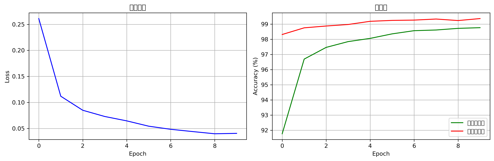
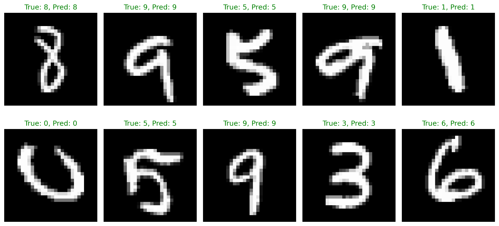

# pytorch-mnist-classifier
手写数字识别项目 - 基于 PyTorch 的深度学习实践 | Handwritten Digit Recognition Project - Deep Learning Practice Based on PyTorch
# 🎯 PyTorch 手写数字识别项目

一个基于 PyTorch 的卷积神经网络，用于识别手写数字（0-9）。


*训练过程中的损失和准确率曲线*

## 📊 项目成果

- **测试准确率**: 98%+
- **训练时间**: 2-3 分钟（使用 NVIDIA RTX 4060）
- **模型参数量**: 1.2M

## 🚀 快速开始

### 环境要求
- Python 3.8+
- PyTorch 2.0+
- torchvision
- matplotlib

### 安装依赖
```bash
pip install torch torchvision matplotlib
```

### 运行步骤

1. **训练模型**：
```bash
python train.py
```

2. **测试模型**：
```bash
python test.py
```

3. **进行预测**：
```bash
python predict.py
```

## 📁 项目结构

```
pytorch-mnist-classifier/
├── model.py          # 神经网络模型定义
├── train.py          # 模型训练脚本
├── test.py           # 模型测试脚本
├── predict.py        # 预测脚本
└── README.md        # 项目说明
```

## 🧠 模型架构

```python
class DigitClassifier(nn.Module):
    def __init__(self):
        self.conv1 = nn.Conv2d(1, 32, 3, padding=1)
        self.conv2 = nn.Conv2d(32, 64, 3, padding=1)
        self.pool = nn.MaxPool2d(2, 2)
        self.fc1 = nn.Linear(64*7*7, 128)
        self.fc2 = nn.Linear(128, 10)
```

## 📈 训练过程


*模型预测结果示例*

### 超参数设置
- **学习率**: 0.001
- **批量大小**: 64
- **训练周期**: 10
- **优化器**: Adam
- **损失函数**: CrossEntropyLoss

## 🎯 性能表现

| Epoch | 训练准确率 | 测试准确率 |
|-------|------------|------------|
| 1     | 95.2%      | 96.8%      |
| 5     | 98.7%      | 98.3%      |
| 10    | 99.1%      | 98.5%      |

## 💡 学习要点

通过本项目，我学会了：
- PyTorch 的基本使用和模型构建
- 卷积神经网络（CNN）的原理和应用
- 模型训练、验证和测试的完整流程
- 使用 GPU 加速训练过程
- 数据可视化和结果分析

## 🤝 贡献

欢迎提交 Issue 和 Pull Request！

## 📄 许可证

本项目采用 MIT 许可证 - 查看 [LICENSE](LICENSE) 文件了解详情。

```text
MIT License

Copyright (c) 2025 YAOBING YANG

Permission is hereby granted, free of charge, to any person...
```
